# Отказоустойчивое хранилище на Ceph

## Задание

1. Разверните отказоустойчивый кластер Ceph с помощью Terraform и Ansible.

    - Установите фактор репликации больший или равный 2.
    - Рассчитайте объём хранилища и число PG для пулов RBD (50–100% от общего объёма) и CephFS (30% от общего объёма).
    - Создайте пулы, объясните логику расчёта.

2. Подключите клиентские машины:

    - Пробросьте 3 RBD-тома;
    - Настройте CephFS как общий раздел для всех клиентов.

3. Отработайте аварийные сценарии:

    3.1. Сгенерировать split-brain, посмотреть поведение кластера, решить проблему (результат - запись консоли с выполнением).
    3.2. Сгенерировать сбой ноды с osd, вывести из кластера, добавить новую.
    3.3. Сгенерировать сбой/обслуживание серверной/дата центра, проверить работоспособность сервисов (результат - запись консоли).
    3.4. Расширить кластер на 2+osd, сделать перерасчёт pg, объяснить логику.
    3.5. Уменьшить кластер на 1+osd, сделать перерасчёт pg, объяснить логику.

## Расчёт объёма хранилища

Объём хранилища можно расчитать по формуле:

```math
\text{Объём хранилища} = {\text{Количество osd} \times \text{Размер одного osd} \over \text{Фактор репликации} }
```

Для `8` дисков объёмом в `10 GiB` и фактором репликации `3` размер хранилища будет `26.6 GiB`.

Количество PG расчитывается по формуле и округляется до ближайшей степени двойки (не меньшей `75%` от полученного количества):

```math
\text{Количество PG} = {100 \times \text{Количество osd} \times \text{Процент общего объёма} \over \text{Фактор репликации} }
```

Для `8` дисков и фактора репликации `3` получаем:

- `256 PG` для RDB пулов в `70%` от общего объёма (`186` округлены до `256`);
- `64 PG` для CephFS пулов в `30%` от общего объёма (`80` округлены до `64`).

Под метаданные для CephFS логично выделить четверть (или меньшее количество) PG, чем под данные (т.е. `16 PG`).

Данные расчёты можно дополнительно проверить с помощью [Ceph PGs Per Pool Calculator](https://docs.ceph.com/en/latest/rados/operations/pgcalc/):

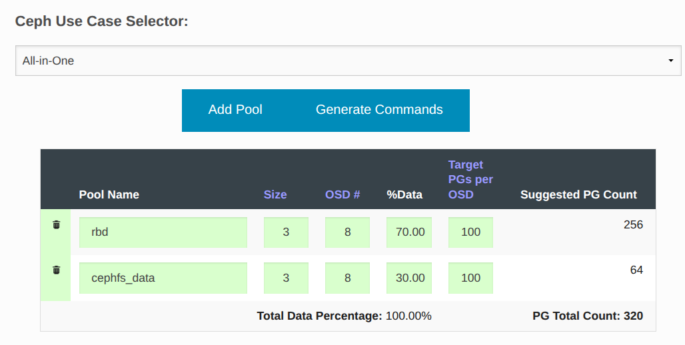

## Реализация

Кластер поднимается помощью **cephadm**, шаблоны спецификаций для которого есть в [roles/ceph/defaults/main.yml](roles/ceph/defaults/main.yml). Никакие сторонние роли при этом не используются.

Задание сделано так, чтобы его можно было запустить как в **Vagrant**, так и в **Yandex Cloud**. После запуска происходит развёртывание следующих виртуальных машин:

- **ceph-cli-01** - клиент ceph;
- **ceph-mon-01** - ceph mon, mgr, osd;
- **ceph-mon-02** - ceph mon, mgr, osd;
- **ceph-mon-03** - ceph mon, osd;
- **ceph-mds-01** - ceph mds, osd;
- **ceph-mds-02** - ceph mds, osd.

В независимости от того, как созданы виртуальные машины, для их настройки запускается **Ansible Playbook** [provision.yml](provision.yml) который последовательно запускает следующие роли:

- **apt_sources** - настраивает репозитории для пакетного менеджера **apt** (используется [mirror.yandex.ru](https://mirror.yandex.ru)).
- **chrony** - устанавливает **chrony** для синхронизации времени между узлами.
- **ceph_repo** - настраивает зеркало для репозитория **download.ceph.com** для последующей установки **ceph**.
- **ceph_common** - устанавливает пакет **ceph_common** на все узлы.
- **ceph** - выполняет **cephadm bootstrap**, создаёт пользователя **ceph-admin**, настраивает для него авторизованные ключи ssh и выполняет **ceph orch apply** для сгененированных шаблонов, настраивает доступ для клиентов.
- **ceph_client** - выполняет настройку на клиенте (аутентификацию, подключение rbd томов и cephfs).
- **haproxy** - так как **Yandex NLB** не поддерживает **HTTPS** проверки (а они нужны, так как активен может быть только один **dashboard** из двух), то для выполнения **healthcheck** устанавливается **haproxy**.

Данные роли настраиваются с помощью переменных, определённых в следующих файлах:

- [group_vars/all.yml](group_vars/all.yml) - общие переменные для всех узлов, а также переменная **ceph_host_osd_spec**, которая позволяет использовать все свободные диски на узлах **mon** и **mgs**, а также переменные **ceph_crush_rules**, **ceph_pools**, **ceph_filesystems** и **ceph_rbd_init**;
- [group_vars/cli.yml](group_vars/cli.yml) - задаёт настройки для клиентов (имя пользователя) и подключаемые тома;
- [group_vars/mds.yml](group_vars/mds.yml) - задаёт метку **mds** для соответствующих узлов и стойку в **ceph_host_location**;
- [group_vars/mon.yml](group_vars/mds.yml) - задаёт метку **mon** для соответствующих узлов и стойку в **ceph_host_location**;
- [host_vars/ceph-mon-01.yml](host_vars/ceph-mon-01.yml) - для узла **ceph-mon-01** добавляет метку **mgr** и использует только один из доступных дисков под osd;
- [host_vars/ceph-mon-02.yml](host_vars/ceph-mon-02.yml) - для узла **ceph-mon-02** добавляет метку **mgr** и использует только один из доступных дисков под osd.

Шаблоны для **ceph orch apply** определены в переменных **ceph_hosts_spec** и **ceph_cluster_spec** в файле [roles/ceph/defaults/main.yml](roles/ceph/defaults/main.yml).

## Запуск

### Запуск в Yandex Cloud

1. Необходимо установить и настроить утилиту **yc** по инструкции [Начало работы с интерфейсом командной строки](https://yandex.cloud/ru/docs/cli/quickstart).
2. Необходимо установить **Terraform** по инструкции [Начало работы с Terraform](https://yandex.cloud/ru/docs/tutorials/infrastructure-management/terraform-quickstart).
3. Необходимо перейти в папку проекта и запустить скрипт [up.sh](up.sh).

### Запуск в Vagrant (VirtualBox)

Необходимо скачать **VagrantBox** для **bento/ubuntu-24.04** версии **202510.26.0** и добавить его в **Vagrant** под именем **bento/ubuntu-24.04/202510.26.0**. Сделать это можно командами:

```shell
curl -OL https://app.vagrantup.com/bento/boxes/ubuntu-24.04/versions/202510.26.0/providers/virtualbox/amd64/vagrant.box
vagrant box add vagrant.box --name "bento/ubuntu-24.04/202510.26.0"
rm vagrant.box
```

После этого нужно сделать **vagrant up** в папке проекта.

## Проверка

Протестировано в **OpenSUSE Tumbleweed**:

- **Vagrant 2.4.9**
- **VirtualBox 7.2.6_SUSE r172322**
- **Ansible 2.20.4**
- **Python 3.13.12**
- **Jinja2 3.1.6**
- **Terraform 1.14.8**

Проверим состояние кластера:

```text
root@ceph-mon-01:~# ceph status
  cluster:
    id:     094cf1d8-482f-11f1-ae30-d00d70944f6e
    health: HEALTH_OK

  services:
    mon: 3 daemons, quorum ceph-mon-01,ceph-mon-03,ceph-mon-02 (age 90m) [leader: ceph-mon-01]
    mgr: ceph-mon-01.irymoj(active, since 97m), standbys: ceph-mon-02.zphryi
    mds: 1/1 daemons up, 1 standby
    osd: 8 osds: 8 up (since 89m), 8 in (since 89m)

  data:
    volumes: 1/1 healthy
    pools:   4 pools, 113 pgs
    objects: 36 objects, 580 KiB
    usage:   792 MiB used, 79 GiB / 80 GiB avail
    pgs:     113 active+clean

root@ceph-mon-01:~# ceph health detail
HEALTH_OK
```

Проверим созданные пулы и занимаемое ими место:

```text
root@ceph-mon-01:~# ceph df
--- RAW STORAGE ---
CLASS    SIZE   AVAIL     USED  RAW USED  %RAW USED
hdd    80 GiB  79 GiB  874 MiB   874 MiB       1.07
TOTAL  80 GiB  79 GiB  874 MiB   874 MiB       1.07

--- POOLS ---
POOL             ID  PGS   STORED  OBJECTS     USED  %USED  MAX AVAIL
.mgr              1    1  961 KiB        2  2.8 MiB      0     25 GiB
rbd               2  256   53 KiB       10  241 KiB      0     25 GiB
cephfs_data       3   64      0 B        0      0 B      0     25 GiB
cephfs_metadata   4   16   18 KiB       22  143 KiB      0     25 GiB

root@ceph-mon-01:~# ceph df
--- RAW STORAGE ---
CLASS    SIZE   AVAIL     USED  RAW USED  %RAW USED
hdd    80 GiB  79 GiB  874 MiB   874 MiB       1.07
TOTAL  80 GiB  79 GiB  874 MiB   874 MiB       1.07

--- POOLS ---
POOL             ID  PGS   STORED  OBJECTS     USED  %USED  MAX AVAIL
.mgr              1    1  961 KiB        2  2.8 MiB      0     25 GiB
rbd               2  256   53 KiB       10  241 KiB      0     25 GiB
cephfs_data       3   64      0 B        0      0 B      0     25 GiB
cephfs_metadata   4   16   18 KiB       22  143 KiB      0     25 GiB

root@ceph-mon-01:~# ceph osd df
ID  CLASS  WEIGHT   REWEIGHT  SIZE    RAW USE  DATA     OMAP     META     AVAIL    %USE  VAR   PGS  STATUS
 0    hdd  0.00980   1.00000  10 GiB  109 MiB   12 MiB  826 KiB   96 MiB  9.9 GiB  1.07  1.00  114      up
 1    hdd  0.00980   1.00000  10 GiB  110 MiB   13 MiB  824 KiB   96 MiB  9.9 GiB  1.07  1.00  109      up
 2    hdd  0.00980   1.00000  10 GiB  109 MiB   12 MiB  828 KiB   96 MiB  9.9 GiB  1.06  1.00  114      up
 3    hdd  0.00980   1.00000  10 GiB  110 MiB   13 MiB  822 KiB   96 MiB  9.9 GiB  1.07  1.00  110      up
 4    hdd  0.00980   1.00000  10 GiB  109 MiB   12 MiB  793 KiB   96 MiB  9.9 GiB  1.06  1.00  108      up
 5    hdd  0.00980   1.00000  10 GiB  109 MiB   12 MiB  752 KiB   96 MiB  9.9 GiB  1.07  1.00  119      up
 6    hdd  0.00980   1.00000  10 GiB  109 MiB   12 MiB  819 KiB   96 MiB  9.9 GiB  1.07  1.00  163      up
 7    hdd  0.00980   1.00000  10 GiB  110 MiB   13 MiB  813 KiB   96 MiB  9.9 GiB  1.07  1.00  174      up
                       TOTAL  80 GiB  874 MiB  100 MiB  6.3 MiB  767 MiB   79 GiB  1.07
MIN/MAX VAR: 1.00/1.00  STDDEV: 0.00
```

Проверим состояние пулов:

```text
root@ceph-mon-01:~# ceph osd pool stats
pool .mgr id 1
  nothing is going on

pool rbd id 2
  nothing is going on

pool cephfs_data id 3
  nothing is going on

pool cephfs_metadata id 4
  nothing is going on
```

Проверим топологию OSD:

```text
root@ceph-mon-01:~# ceph osd tree
ID  CLASS  WEIGHT   TYPE NAME                 STATUS  REWEIGHT  PRI-AFF
-1         0.07837  root default
-3         0.02939      rack rack1
-2         0.01959          host ceph-mds-01
 0    hdd  0.00980              osd.0             up   1.00000  1.00000
 1    hdd  0.00980              osd.1             up   1.00000  1.00000
-6         0.00980          host ceph-mon-01
 2    hdd  0.00980              osd.2             up   1.00000  1.00000
-5         0.02939      rack rack2
-4         0.01959          host ceph-mds-02
 3    hdd  0.00980              osd.3             up   1.00000  1.00000
 4    hdd  0.00980              osd.4             up   1.00000  1.00000
-7         0.00980          host ceph-mon-02
 5    hdd  0.00980              osd.5             up   1.00000  1.00000
-9         0.01959      rack rack3
-8         0.01959          host ceph-mon-03
 6    hdd  0.00980              osd.6             up   1.00000  1.00000
 7    hdd  0.00980              osd.7             up   1.00000  1.00000
```

Проверим кворум:

```text
root@ceph-mon-01:~# ceph mon stat
e3: 3 mons at {ceph-mon-01=[v2:10.130.0.41:3300/0,v1:10.130.0.41:6789/0],ceph-mon-02=[v2:10.130.0.42:3300/0,v1:10.130.0.42:6789/0],ceph-mon-03=[v2:10.130.0.43:3300/0,v1:10.130.0.43:6789/0]} removed_ranks: {} disallowed_leaders: {}, election epoch 14, leader 0 ceph-mon-01, quorum 0,1,2 ceph-mon-01,ceph-mon-03,ceph-mon-02

root@ceph-mon-01:~# ceph quorum_status | jq
{
  "election_epoch": 14,
  "quorum": [
    0,
    1,
    2
  ],
  "quorum_names": [
    "ceph-mon-01",
    "ceph-mon-03",
    "ceph-mon-02"
  ],
  "quorum_leader_name": "ceph-mon-01",
  "quorum_age": 6421,
  "features": {
    "quorum_con": "4541880224203014143",
    "quorum_mon": [
      "kraken",
      "luminous",
      "mimic",
      "osdmap-prune",
      "nautilus",
      "octopus",
      "pacific",
      "elector-pinging",
      "quincy",
      "reef",
      "squid",
      "tentacle"
    ]
  },
  "monmap": {
    "epoch": 3,
    "fsid": "094cf1d8-482f-11f1-ae30-d00d70944f6e",
    "modified": "2026-05-05T03:13:51.787733Z",
    "created": "2026-05-05T03:06:04.578612Z",
    "min_mon_release": 20,
    "min_mon_release_name": "tentacle",
    "election_strategy": 1,
    "disallowed_leaders": "",
    "stretch_mode": false,
    "tiebreaker_mon": "",
    "removed_ranks": "",
    "features": {
      "persistent": [
        "kraken",
        "luminous",
        "mimic",
        "osdmap-prune",
        "nautilus",
        "octopus",
        "pacific",
        "elector-pinging",
        "quincy",
        "reef",
        "squid",
        "tentacle"
      ],
      "optional": []
    },
    "mons": [
      {
        "rank": 0,
        "name": "ceph-mon-01",
        "public_addrs": {
          "addrvec": [
            {
              "type": "v2",
              "addr": "10.130.0.41:3300",
              "nonce": 0
            },
            {
              "type": "v1",
              "addr": "10.130.0.41:6789",
              "nonce": 0
            }
          ]
        },
        "addr": "10.130.0.41:6789/0",
        "public_addr": "10.130.0.41:6789/0",
        "priority": 0,
        "weight": 0,
        "crush_location": "{}"
      },
      {
        "rank": 1,
        "name": "ceph-mon-03",
        "public_addrs": {
          "addrvec": [
            {
              "type": "v2",
              "addr": "10.130.0.43:3300",
              "nonce": 0
            },
            {
              "type": "v1",
              "addr": "10.130.0.43:6789",
              "nonce": 0
            }
          ]
        },
        "addr": "10.130.0.43:6789/0",
        "public_addr": "10.130.0.43:6789/0",
        "priority": 0,
        "weight": 0,
        "crush_location": "{}"
      },
      {
        "rank": 2,
        "name": "ceph-mon-02",
        "public_addrs": {
          "addrvec": [
            {
              "type": "v2",
              "addr": "10.130.0.42:3300",
              "nonce": 0
            },
            {
              "type": "v1",
              "addr": "10.130.0.42:6789",
              "nonce": 0
            }
          ]
        },
        "addr": "10.130.0.42:6789/0",
        "public_addr": "10.130.0.42:6789/0",
        "priority": 0,
        "weight": 0,
        "crush_location": "{}"
      }
    ]
  }
}
```

Проверим активные модули для менеджера:

```text
root@ceph-mon-01:~# ceph mgr module ls
MODULE
balancer              on (always on)
crash                 on (always on)
devicehealth          on (always on)
orchestrator          on (always on)
pg_autoscaler         on (always on)
progress              on (always on)
rbd_support           on (always on)
status                on (always on)
telemetry             on (always on)
volumes               on (always on)
cephadm               on
dashboard             on
iostat                on
nfs                   on
alerts                -
diskprediction_local  -
influx                -
insights              -
k8sevents             -
localpool             -
mds_autoscaler        -
mirroring             -
osd_perf_query        -
osd_support           -
prometheus            -
rgw                   -
rook                  -
selftest              -
smb                   -
snap_schedule         -
stats                 -
telegraf              -
test_orchestrator     -
```

Проверим состояние MDS:

```text
root@ceph-mon-01:~# ceph mds stat
cephfs:1 {0=cephfs.ceph-mds-02.yripfz=up:active} 1 up:standby
```

Проверим состояние PG:

```text
root@ceph-mon-01:~# ceph pg stat
337 pgs: 337 active+clean; 580 KiB data, 874 MiB used, 79 GiB / 80 GiB avail

root@ceph-mon-01:~# ceph pg dump osds
OSD_STAT  USED     AVAIL    USED_RAW  TOTAL   HB_PEERS         PG_SUM  PRIMARY_PG_SUM
7         110 MiB  9.9 GiB   110 MiB  10 GiB  [0,1,2,3,4,5,6]     174              44
6         109 MiB  9.9 GiB   109 MiB  10 GiB  [0,1,2,3,4,5,7]     163              45
5         109 MiB  9.9 GiB   109 MiB  10 GiB  [0,1,2,3,4,6,7]     119              45
4         109 MiB  9.9 GiB   109 MiB  10 GiB  [0,1,2,3,5,6,7]     108              37
3         110 MiB  9.9 GiB   110 MiB  10 GiB  [0,1,2,4,5,6,7]     110              42
2         109 MiB  9.9 GiB   109 MiB  10 GiB  [0,1,3,4,5,6,7]     114              46
1         110 MiB  9.9 GiB   110 MiB  10 GiB  [0,2,3,4,5,6,7]     109              36
0         109 MiB  9.9 GiB   109 MiB  10 GiB  [1,2,3,4,5,6,7]     114              42
sum       874 MiB   79 GiB   874 MiB  80 GiB
dumped osds

root@ceph-mon-01:~# ceph pg dump pgs_brief
PG_STAT  STATE         UP       UP_PRIMARY  ACTING   ACTING_PRIMARY
2.ff     active+clean  [1,3,7]           1  [1,3,7]               1
2.fe     active+clean  [0,3,6]           0  [0,3,6]               0
2.fd     active+clean  [6,5,0]           6  [6,5,0]               6
2.fc     active+clean  [0,5,7]           0  [0,5,7]               0
2.fb     active+clean  [3,7,0]           3  [3,7,0]               3
2.fa     active+clean  [2,7,5]           2  [2,7,5]               2
2.f9     active+clean  [2,4,6]           2  [2,4,6]               2
2.f8     active+clean  [7,0,5]           7  [7,0,5]               7
2.f7     active+clean  [2,5,7]           2  [2,5,7]               2
2.f6     active+clean  [4,7,0]           4  [4,7,0]               4
2.f5     active+clean  [0,3,6]           0  [0,3,6]               0
2.f4     active+clean  [4,0,7]           4  [4,0,7]               4
2.f3     active+clean  [2,5,6]           2  [2,5,6]               2
2.f2     active+clean  [5,1,7]           5  [5,1,7]               5
2.f1     active+clean  [5,2,6]           5  [5,2,6]               5
2.f0     active+clean  [4,0,7]           4  [4,0,7]               4
2.ef     active+clean  [1,7,4]           1  [1,7,4]               1
2.ee     active+clean  [2,4,6]           2  [2,4,6]               2
2.ed     active+clean  [0,4,6]           0  [0,4,6]               0
2.ec     active+clean  [2,5,7]           2  [2,5,7]               2
2.eb     active+clean  [4,6,2]           4  [4,6,2]               4
2.ea     active+clean  [0,7,5]           0  [0,7,5]               0
2.e9     active+clean  [3,1,6]           3  [3,1,6]               3
2.e8     active+clean  [6,0,3]           6  [6,0,3]               6
2.e7     active+clean  [7,1,3]           7  [7,1,3]               7
2.e6     active+clean  [6,4,1]           6  [6,4,1]               6
2.e5     active+clean  [0,6,5]           0  [0,6,5]               0
2.e4     active+clean  [0,4,7]           0  [0,4,7]               0
2.e3     active+clean  [2,4,7]           2  [2,4,7]               2
2.e2     active+clean  [2,5,7]           2  [2,5,7]               2
2.e1     active+clean  [2,7,3]           2  [2,7,3]               2
2.e0     active+clean  [3,2,7]           3  [3,2,7]               3
2.df     active+clean  [0,5,7]           0  [0,5,7]               0
2.de     active+clean  [2,4,6]           2  [2,4,6]               2
2.dd     active+clean  [1,7,3]           1  [1,7,3]               1
2.dc     active+clean  [0,4,6]           0  [0,4,6]               0
2.db     active+clean  [1,7,3]           1  [1,7,3]               1
2.da     active+clean  [7,3,1]           7  [7,3,1]               7
2.d9     active+clean  [3,7,0]           3  [3,7,0]               3
2.d8     active+clean  [4,2,7]           4  [4,2,7]               4
2.d7     active+clean  [5,0,7]           5  [5,0,7]               5
2.d6     active+clean  [6,5,0]           6  [6,5,0]               6
2.d5     active+clean  [4,1,6]           4  [4,1,6]               4
2.d4     active+clean  [3,2,6]           3  [3,2,6]               3
2.d3     active+clean  [0,7,3]           0  [0,7,3]               0
2.d2     active+clean  [4,1,7]           4  [4,1,7]               4
2.d1     active+clean  [3,6,0]           3  [3,6,0]               3
2.d0     active+clean  [7,3,1]           7  [7,3,1]               7
2.cf     active+clean  [2,3,6]           2  [2,3,6]               2
2.ce     active+clean  [7,0,3]           7  [7,0,3]               7
2.cd     active+clean  [7,4,2]           7  [7,4,2]               7
2.cc     active+clean  [1,6,5]           1  [1,6,5]               1
2.cb     active+clean  [4,2,7]           4  [4,2,7]               4
2.ca     active+clean  [0,6,3]           0  [0,6,3]               0
2.c9     active+clean  [5,0,6]           5  [5,0,6]               5
2.c8     active+clean  [0,6,5]           0  [0,6,5]               0
2.c7     active+clean  [4,2,6]           4  [4,2,6]               4
2.c6     active+clean  [6,4,0]           6  [6,4,0]               6
2.c5     active+clean  [1,7,5]           1  [1,7,5]               1
2.c4     active+clean  [4,2,7]           4  [4,2,7]               4
2.c3     active+clean  [1,7,4]           1  [1,7,4]               1
2.c2     active+clean  [6,1,4]           6  [6,1,4]               6
2.c1     active+clean  [0,4,6]           0  [0,4,6]               0
2.c0     active+clean  [0,3,7]           0  [0,3,7]               0
2.bf     active+clean  [4,6,2]           4  [4,6,2]               4
2.be     active+clean  [3,1,7]           3  [3,1,7]               3
2.bd     active+clean  [1,3,6]           1  [1,3,6]               1
2.bc     active+clean  [2,3,7]           2  [2,3,7]               2
2.bb     active+clean  [0,7,5]           0  [0,7,5]               0
2.ba     active+clean  [6,1,4]           6  [6,1,4]               6
2.b9     active+clean  [0,5,7]           0  [0,5,7]               0
2.b8     active+clean  [4,1,7]           4  [4,1,7]               4
2.b7     active+clean  [4,2,6]           4  [4,2,6]               4
2.b6     active+clean  [5,0,6]           5  [5,0,6]               5
2.b5     active+clean  [6,4,1]           6  [6,4,1]               6
2.b4     active+clean  [5,6,0]           5  [5,6,0]               5
2.b3     active+clean  [3,0,7]           3  [3,0,7]               3
2.b2     active+clean  [6,2,5]           6  [6,2,5]               6
2.b1     active+clean  [0,7,5]           0  [0,7,5]               0
2.b0     active+clean  [4,7,2]           4  [4,7,2]               4
2.af     active+clean  [5,7,2]           5  [5,7,2]               5
2.ae     active+clean  [7,5,1]           7  [7,5,1]               7
2.ad     active+clean  [4,1,6]           4  [4,1,6]               4
2.ac     active+clean  [1,7,3]           1  [1,7,3]               1
2.ab     active+clean  [2,7,4]           2  [2,7,4]               2
2.aa     active+clean  [7,1,3]           7  [7,1,3]               7
2.a9     active+clean  [4,1,7]           4  [4,1,7]               4
2.a8     active+clean  [6,5,0]           6  [6,5,0]               6
2.a7     active+clean  [2,6,5]           2  [2,6,5]               2
2.a6     active+clean  [4,7,1]           4  [4,7,1]               4
2.a5     active+clean  [2,7,4]           2  [2,7,4]               2
2.a4     active+clean  [2,3,7]           2  [2,3,7]               2
2.a3     active+clean  [7,4,0]           7  [7,4,0]               7
2.a2     active+clean  [4,0,7]           4  [4,0,7]               4
2.a1     active+clean  [5,2,7]           5  [5,2,7]               5
2.a0     active+clean  [3,1,6]           3  [3,1,6]               3
2.9f     active+clean  [4,1,7]           4  [4,1,7]               4
2.9e     active+clean  [0,3,7]           0  [0,3,7]               0
2.9d     active+clean  [4,6,1]           4  [4,6,1]               4
2.9c     active+clean  [7,4,1]           7  [7,4,1]               7
2.9b     active+clean  [3,6,1]           3  [3,6,1]               3
2.9a     active+clean  [0,7,4]           0  [0,7,4]               0
2.99     active+clean  [3,2,7]           3  [3,2,7]               3
2.98     active+clean  [1,5,7]           1  [1,5,7]               1
2.97     active+clean  [7,3,0]           7  [7,3,0]               7
2.96     active+clean  [1,3,6]           1  [1,3,6]               1
2.95     active+clean  [5,6,0]           5  [5,6,0]               5
2.94     active+clean  [4,6,0]           4  [4,6,0]               4
2.93     active+clean  [2,5,7]           2  [2,5,7]               2
2.92     active+clean  [2,7,5]           2  [2,7,5]               2
2.91     active+clean  [6,3,0]           6  [6,3,0]               6
2.90     active+clean  [4,0,7]           4  [4,0,7]               4
2.8f     active+clean  [4,6,2]           4  [4,6,2]               4
2.8e     active+clean  [6,0,5]           6  [6,0,5]               6
2.8d     active+clean  [6,5,1]           6  [6,5,1]               6
2.8c     active+clean  [0,3,6]           0  [0,3,6]               0
2.8b     active+clean  [1,5,6]           1  [1,5,6]               1
2.8a     active+clean  [1,7,5]           1  [1,7,5]               1
2.89     active+clean  [6,0,3]           6  [6,0,3]               6
2.88     active+clean  [5,2,7]           5  [5,2,7]               5
2.87     active+clean  [1,6,3]           1  [1,6,3]               1
2.86     active+clean  [6,5,1]           6  [6,5,1]               6
2.85     active+clean  [4,1,6]           4  [4,1,6]               4
2.84     active+clean  [1,6,5]           1  [1,6,5]               1
2.83     active+clean  [1,6,5]           1  [1,6,5]               1
2.82     active+clean  [6,1,3]           6  [6,1,3]               6
2.81     active+clean  [2,4,7]           2  [2,4,7]               2
2.80     active+clean  [4,7,0]           4  [4,7,0]               4
2.7f     active+clean  [4,1,7]           4  [4,1,7]               4
2.7e     active+clean  [0,5,6]           0  [0,5,6]               0
2.7d     active+clean  [0,6,5]           0  [0,6,5]               0
2.7c     active+clean  [1,5,6]           1  [1,5,6]               1
2.7b     active+clean  [3,6,1]           3  [3,6,1]               3
2.7a     active+clean  [7,0,4]           7  [7,0,4]               7
2.79     active+clean  [0,7,5]           0  [0,7,5]               0
2.78     active+clean  [1,5,6]           1  [1,5,6]               1
2.77     active+clean  [1,7,3]           1  [1,7,3]               1
2.76     active+clean  [5,2,7]           5  [5,2,7]               5
2.75     active+clean  [7,2,4]           7  [7,2,4]               7
2.74     active+clean  [4,0,7]           4  [4,0,7]               4
2.73     active+clean  [4,6,0]           4  [4,6,0]               4
2.72     active+clean  [3,0,7]           3  [3,0,7]               3
2.71     active+clean  [3,7,1]           3  [3,7,1]               3
2.70     active+clean  [3,2,7]           3  [3,2,7]               3
2.6f     active+clean  [0,7,4]           0  [0,7,4]               0
2.6e     active+clean  [7,2,5]           7  [7,2,5]               7
2.6d     active+clean  [0,6,3]           0  [0,6,3]               0
2.6c     active+clean  [0,6,5]           0  [0,6,5]               0
2.6b     active+clean  [5,1,7]           5  [5,1,7]               5
2.6a     active+clean  [6,3,0]           6  [6,3,0]               6
2.69     active+clean  [6,3,0]           6  [6,3,0]               6
2.68     active+clean  [3,2,6]           3  [3,2,6]               3
2.67     active+clean  [7,1,3]           7  [7,1,3]               7
2.66     active+clean  [3,7,1]           3  [3,7,1]               3
2.65     active+clean  [6,3,0]           6  [6,3,0]               6
2.64     active+clean  [7,0,5]           7  [7,0,5]               7
2.63     active+clean  [7,2,5]           7  [7,2,5]               7
2.62     active+clean  [1,7,5]           1  [1,7,5]               1
2.61     active+clean  [3,0,7]           3  [3,0,7]               3
2.60     active+clean  [6,0,3]           6  [6,0,3]               6
2.5f     active+clean  [3,1,6]           3  [3,1,6]               3
2.5e     active+clean  [3,2,6]           3  [3,2,6]               3
2.5d     active+clean  [2,7,4]           2  [2,7,4]               2
2.5c     active+clean  [2,5,7]           2  [2,5,7]               2
2.5b     active+clean  [7,4,0]           7  [7,4,0]               7
2.5a     active+clean  [6,0,4]           6  [6,0,4]               6
2.59     active+clean  [5,6,1]           5  [5,6,1]               5
2.58     active+clean  [5,2,7]           5  [5,2,7]               5
2.57     active+clean  [6,5,2]           6  [6,5,2]               6
2.56     active+clean  [2,5,6]           2  [2,5,6]               2
2.55     active+clean  [5,0,6]           5  [5,0,6]               5
2.54     active+clean  [1,7,4]           1  [1,7,4]               1
2.53     active+clean  [4,1,6]           4  [4,1,6]               4
2.52     active+clean  [0,7,3]           0  [0,7,3]               0
2.51     active+clean  [5,1,7]           5  [5,1,7]               5
2.50     active+clean  [1,5,6]           1  [1,5,6]               1
2.4f     active+clean  [2,3,6]           2  [2,3,6]               2
2.4e     active+clean  [6,0,4]           6  [6,0,4]               6
2.4d     active+clean  [2,3,6]           2  [2,3,6]               2
2.4c     active+clean  [6,5,0]           6  [6,5,0]               6
2.4b     active+clean  [2,4,7]           2  [2,4,7]               2
2.4a     active+clean  [5,6,1]           5  [5,6,1]               5
2.49     active+clean  [7,4,2]           7  [7,4,2]               7
2.48     active+clean  [2,4,6]           2  [2,4,6]               2
2.47     active+clean  [0,5,7]           0  [0,5,7]               0
2.46     active+clean  [7,3,2]           7  [7,3,2]               7
2.45     active+clean  [2,6,4]           2  [2,6,4]               2
2.44     active+clean  [6,5,2]           6  [6,5,2]               6
2.43     active+clean  [3,6,1]           3  [3,6,1]               3
2.42     active+clean  [7,0,3]           7  [7,0,3]               7
2.41     active+clean  [6,4,1]           6  [6,4,1]               6
2.40     active+clean  [5,7,0]           5  [5,7,0]               5
2.3f     active+clean  [3,2,7]           3  [3,2,7]               3
3.3e     active+clean  [2,4,7]           2  [2,4,7]               2
2.3e     active+clean  [2,6,5]           2  [2,6,5]               2
3.3f     active+clean  [5,6,0]           5  [5,6,0]               5
2.3d     active+clean  [1,7,4]           1  [1,7,4]               1
3.3c     active+clean  [4,2,7]           4  [4,2,7]               4
2.3c     active+clean  [3,1,6]           3  [3,1,6]               3
3.3d     active+clean  [7,0,4]           7  [7,0,4]               7
2.3b     active+clean  [6,4,0]           6  [6,4,0]               6
3.3a     active+clean  [7,2,4]           7  [7,2,4]               7
2.3a     active+clean  [0,7,4]           0  [0,7,4]               0
3.3b     active+clean  [5,0,7]           5  [5,0,7]               5
3.1a     active+clean  [7,1,4]           7  [7,1,4]               7
2.1b     active+clean  [2,4,7]           2  [2,4,7]               2
3.1b     active+clean  [0,4,7]           0  [0,4,7]               0
2.1a     active+clean  [5,1,6]           5  [5,1,6]               5
3.18     active+clean  [1,6,3]           1  [1,6,3]               1
2.19     active+clean  [2,4,7]           2  [2,4,7]               2
3.19     active+clean  [1,5,6]           1  [1,5,6]               1
2.18     active+clean  [6,4,1]           6  [6,4,1]               6
3.16     active+clean  [4,2,7]           4  [4,2,7]               4
2.17     active+clean  [4,2,7]           4  [4,2,7]               4
3.17     active+clean  [6,3,2]           6  [6,3,2]               6
2.16     active+clean  [5,7,1]           5  [5,7,1]               5
3.14     active+clean  [3,7,2]           3  [3,7,2]               3
2.15     active+clean  [7,2,5]           7  [7,2,5]               7
3.15     active+clean  [7,2,5]           7  [7,2,5]               7
2.14     active+clean  [5,6,1]           5  [5,6,1]               5
3.12     active+clean  [6,3,0]           6  [6,3,0]               6
2.13     active+clean  [7,4,1]           7  [7,4,1]               7
3.13     active+clean  [3,6,0]           3  [3,6,0]               3
2.12     active+clean  [5,1,6]           5  [5,1,6]               5
3.10     active+clean  [5,2,7]           5  [5,2,7]               5
2.11     active+clean  [6,5,2]           6  [6,5,2]               6
3.11     active+clean  [5,6,1]           5  [5,6,1]               5
2.10     active+clean  [7,2,3]           7  [7,2,3]               7
4.9      active+clean  [6,1,5]           6  [6,1,5]               6
3.e      active+clean  [3,6,0]           3  [3,6,0]               3
2.f      active+clean  [6,4,0]           6  [6,4,0]               6
4.8      active+clean  [5,6,2]           5  [5,6,2]               5
3.f      active+clean  [3,7,2]           3  [3,7,2]               3
2.e      active+clean  [2,7,3]           2  [2,7,3]               2
4.b      active+clean  [7,5,2]           7  [7,5,2]               7
3.c      active+clean  [3,0,7]           3  [3,0,7]               3
2.d      active+clean  [6,3,2]           6  [6,3,2]               6
4.a      active+clean  [4,6,1]           4  [4,6,1]               4
3.d      active+clean  [3,2,7]           3  [3,2,7]               3
2.c      active+clean  [6,0,4]           6  [6,0,4]               6
4.5      active+clean  [6,3,1]           6  [6,3,1]               6
3.2      active+clean  [7,5,1]           7  [7,5,1]               7
1.0      active+clean  [7,3,1]           7  [7,3,1]               7
2.3      active+clean  [4,7,2]           4  [4,7,2]               4
4.6      active+clean  [0,4,7]           0  [0,4,7]               0
3.1      active+clean  [2,4,6]           2  [2,4,6]               2
2.0      active+clean  [3,1,7]           3  [3,1,7]               3
4.7      active+clean  [1,6,5]           1  [1,6,5]               1
3.0      active+clean  [1,5,7]           1  [1,5,7]               1
2.1      active+clean  [7,0,3]           7  [7,0,3]               7
4.4      active+clean  [6,0,5]           6  [6,0,5]               6
3.3      active+clean  [6,5,0]           6  [6,5,0]               6
2.2      active+clean  [3,2,7]           3  [3,2,7]               3
2.39     active+clean  [7,3,1]           7  [7,3,1]               7
3.38     active+clean  [1,5,6]           1  [1,5,6]               1
4.2      active+clean  [6,5,2]           6  [6,5,2]               6
3.5      active+clean  [3,2,6]           3  [3,2,6]               3
2.4      active+clean  [1,5,6]           1  [1,5,6]               1
4.3      active+clean  [7,5,2]           7  [7,5,2]               7
3.4      active+clean  [2,7,4]           2  [2,7,4]               2
2.5      active+clean  [5,0,7]           5  [5,0,7]               5
4.0      active+clean  [0,4,6]           0  [0,4,6]               0
3.7      active+clean  [2,7,4]           2  [2,7,4]               2
2.6      active+clean  [2,3,6]           2  [2,3,6]               2
4.1      active+clean  [6,4,1]           6  [6,4,1]               6
3.6      active+clean  [2,4,7]           2  [2,4,7]               2
2.7      active+clean  [3,7,1]           3  [3,7,1]               3
4.e      active+clean  [4,6,1]           4  [4,6,1]               4
3.9      active+clean  [5,6,1]           5  [5,6,1]               5
2.8      active+clean  [7,5,2]           7  [7,5,2]               7
4.f      active+clean  [1,6,3]           1  [1,6,3]               1
3.8      active+clean  [6,2,3]           6  [6,2,3]               6
2.9      active+clean  [2,4,6]           2  [2,4,6]               2
4.c      active+clean  [5,1,7]           5  [5,1,7]               5
3.b      active+clean  [1,6,5]           1  [1,6,5]               1
2.a      active+clean  [1,7,4]           1  [1,7,4]               1
4.d      active+clean  [3,7,0]           3  [3,7,0]               3
3.a      active+clean  [5,2,6]           5  [5,2,6]               5
2.b      active+clean  [3,7,2]           3  [3,7,2]               3
3.1d     active+clean  [7,4,1]           7  [7,4,1]               7
2.1c     active+clean  [7,4,1]           7  [7,4,1]               7
3.1c     active+clean  [4,1,6]           4  [4,1,6]               4
2.1d     active+clean  [7,3,2]           7  [7,3,2]               7
3.1f     active+clean  [7,0,3]           7  [7,0,3]               7
2.1e     active+clean  [2,4,6]           2  [2,4,6]               2
3.1e     active+clean  [2,6,3]           2  [2,6,3]               2
2.1f     active+clean  [0,5,7]           0  [0,5,7]               0
2.20     active+clean  [3,1,6]           3  [3,1,6]               3
3.21     active+clean  [0,3,6]           0  [0,3,6]               0
2.21     active+clean  [2,6,3]           2  [2,6,3]               2
3.20     active+clean  [5,0,7]           5  [5,0,7]               5
2.22     active+clean  [3,7,2]           3  [3,7,2]               3
3.23     active+clean  [0,4,7]           0  [0,4,7]               0
2.23     active+clean  [0,3,7]           0  [0,3,7]               0
3.22     active+clean  [5,1,6]           5  [5,1,6]               5
2.24     active+clean  [3,6,1]           3  [3,6,1]               3
3.25     active+clean  [1,7,3]           1  [1,7,3]               1
2.25     active+clean  [5,2,6]           5  [5,2,6]               5
3.24     active+clean  [0,6,3]           0  [0,6,3]               0
2.26     active+clean  [7,3,1]           7  [7,3,1]               7
3.27     active+clean  [2,4,6]           2  [2,4,6]               2
2.27     active+clean  [5,7,2]           5  [5,7,2]               5
3.26     active+clean  [3,7,0]           3  [3,7,0]               3
2.28     active+clean  [0,7,3]           0  [0,7,3]               0
3.29     active+clean  [2,7,4]           2  [2,7,4]               2
2.29     active+clean  [3,1,6]           3  [3,1,6]               3
3.28     active+clean  [5,2,7]           5  [5,2,7]               5
2.2a     active+clean  [5,2,6]           5  [5,2,6]               5
3.2b     active+clean  [0,3,6]           0  [0,3,6]               0
2.2b     active+clean  [1,4,6]           1  [1,4,6]               1
3.2a     active+clean  [7,3,0]           7  [7,3,0]               7
2.2c     active+clean  [2,7,5]           2  [2,7,5]               2
3.2d     active+clean  [5,2,7]           5  [5,2,7]               5
2.2d     active+clean  [3,1,6]           3  [3,1,6]               3
3.2c     active+clean  [6,5,0]           6  [6,5,0]               6
2.2e     active+clean  [5,0,6]           5  [5,0,6]               5
3.2f     active+clean  [7,4,0]           7  [7,4,0]               7
2.2f     active+clean  [5,6,0]           5  [5,6,0]               5
3.2e     active+clean  [0,4,6]           0  [0,4,6]               0
2.30     active+clean  [5,6,0]           5  [5,6,0]               5
3.31     active+clean  [1,4,6]           1  [1,4,6]               1
2.31     active+clean  [0,7,4]           0  [0,7,4]               0
3.30     active+clean  [5,0,7]           5  [5,0,7]               5
2.32     active+clean  [6,4,1]           6  [6,4,1]               6
3.33     active+clean  [0,6,3]           0  [0,6,3]               0
2.33     active+clean  [3,2,6]           3  [3,2,6]               3
3.32     active+clean  [2,5,6]           2  [2,5,6]               2
2.34     active+clean  [4,2,7]           4  [4,2,7]               4
3.35     active+clean  [5,0,6]           5  [5,0,6]               5
2.35     active+clean  [2,6,3]           2  [2,6,3]               2
3.34     active+clean  [7,3,1]           7  [7,3,1]               7
2.36     active+clean  [1,5,6]           1  [1,5,6]               1
3.37     active+clean  [7,5,0]           7  [7,5,0]               7
2.37     active+clean  [5,6,2]           5  [5,6,2]               5
3.36     active+clean  [6,5,2]           6  [6,5,2]               6
2.38     active+clean  [6,4,1]           6  [6,4,1]               6
3.39     active+clean  [5,2,7]           5  [5,2,7]               5
dumped pgs_brief
```

Проверим настройки аутентификации:

```text
root@ceph-mon-01:~# ceph auth ls | grep -v key
mds.cephfs.ceph-mds-01.iiosbk
        caps: [mds] allow
        caps: [mon] profile mds
        caps: [osd] allow rw tag cephfs *=*
mds.cephfs.ceph-mds-02.yripfz
        caps: [mds] allow
        caps: [mon] profile mds
        caps: [osd] allow rw tag cephfs *=*
osd.0
        caps: [mgr] allow profile osd
        caps: [mon] allow profile osd
        caps: [osd] allow *
osd.1
        caps: [mgr] allow profile osd
        caps: [mon] allow profile osd
        caps: [osd] allow *
osd.2
        caps: [mgr] allow profile osd
        caps: [mon] allow profile osd
        caps: [osd] allow *
osd.3
        caps: [mgr] allow profile osd
        caps: [mon] allow profile osd
        caps: [osd] allow *
osd.4
        caps: [mgr] allow profile osd
        caps: [mon] allow profile osd
        caps: [osd] allow *
osd.5
        caps: [mgr] allow profile osd
        caps: [mon] allow profile osd
        caps: [osd] allow *
osd.6
        caps: [mgr] allow profile osd
        caps: [mon] allow profile osd
        caps: [osd] allow *
osd.7
        caps: [mgr] allow profile osd
        caps: [mon] allow profile osd
        caps: [osd] allow *
client.admin
        caps: [mds] allow *
        caps: [mgr] allow *
        caps: [mon] allow *
        caps: [osd] allow *
client.bootstrap-mds
        caps: [mon] allow profile bootstrap-mds
client.bootstrap-mgr
        caps: [mon] allow profile bootstrap-mgr
client.bootstrap-osd
        caps: [mon] allow profile bootstrap-osd
client.bootstrap-rbd
        caps: [mon] allow profile bootstrap-rbd
client.bootstrap-rbd-mirror
        caps: [mon] allow profile bootstrap-rbd-mirror
client.bootstrap-rgw
        caps: [mon] allow profile bootstrap-rgw
client.crash.ceph-mds-01
        caps: [mgr] profile crash
        caps: [mon] profile crash
client.crash.ceph-mds-02
        caps: [mgr] profile crash
        caps: [mon] profile crash
client.crash.ceph-mon-01
        caps: [mgr] profile crash
        caps: [mon] profile crash
client.crash.ceph-mon-02
        caps: [mgr] profile crash
        caps: [mon] profile crash
client.crash.ceph-mon-03
        caps: [mgr] profile crash
        caps: [mon] profile crash
client.user
        caps: [mds] allow rw path=/
        caps: [mon] allow r
        caps: [osd] profile rbd pool=rbd, allow rw pool=cephfs_data
mgr.ceph-mon-01.irymoj
        caps: [mds] allow *
        caps: [mon] profile mgr
        caps: [osd] allow *
mgr.ceph-mon-02.zphryi
        caps: [mds] allow *
        caps: [mon] profile mgr
        caps: [osd] allow *
```

Проверим, что rbd тома доступны на клиенте:

```text
root@ceph-cli-01:~# rbd device list
id  pool  namespace  image  snap  device
0   rbd              vol1   -     /dev/rbd0
1   rbd              vol2   -     /dev/rbd1
2   rbd              vol3   -     /dev/rbd2

root@ceph-cli-01:~# lsblk
NAME    MAJ:MIN RM  SIZE RO TYPE MOUNTPOINTS
rbd0    251:0    0    1G  0 disk
rbd1    251:16   0    1G  0 disk
rbd2    251:32   0    1G  0 disk
vda     253:0    0   20G  0 disk
├─vda1  253:1    0 19.4G  0 part /
├─vda14 253:14   0    4M  0 part
└─vda15 253:15   0  600M  0 part /boot/efi
```

Проверим информацию по **rbd** тому:

```text
root@ceph-cli-01:~# rbd --id user status rbd/vol1
Watchers:
        watcher=10.130.0.11:0/2995149662 client.24185 cookie=18446462598732840961
root@ceph-cli-01:~# rbd --id user info rbd/vol1
rbd image 'vol1':
        size 1 GiB in 256 objects
        order 22 (4 MiB objects)
        snapshot_count: 0
        id: 387f81533da4
        block_name_prefix: rbd_data.387f81533da4
        format: 2
        features: layering, exclusive-lock, object-map, fast-diff, deep-flatten
        op_features:
        flags:
        create_timestamp: Tue May  5 03:15:41 2026
        access_timestamp: Tue May  5 03:15:41 2026
        modify_timestamp: Tue May  5 03:15:41 2026
```

Проверим подключение **cephfs**:

```text
root@ceph-cli-01:~# findmnt -t ceph
TARGET      SOURCE             FSTYPE OPTIONS
/mnt/cephfs 10.130.0.41:6789:/ ceph   rw,relatime,name=user,secret=<hidden>,fsid=094cf1d8-482f-11f1-ae30-d00d70944f6e,acl

root@ceph-cli-01:~# stat -f /mnt/cephfs
  File: "/mnt/cephfs"
    ID: 4a7fc79fffffffff Namelen: 255     Type: ceph
Block size: 4194304    Fundamental block size: 4194304
Blocks: Total: 6409       Free: 6409       Available: 6409
Inodes: Total: 0          Free: -1

root@ceph-cli-01:~# df -hT
Filesystem         Type   Size  Used Avail Use% Mounted on
tmpfs              tmpfs  197M  1.1M  196M   1% /run
/dev/vda1          ext4    19G  2.5G   17G  13% /
tmpfs              tmpfs  984M     0  984M   0% /dev/shm
tmpfs              tmpfs  5.0M     0  5.0M   0% /run/lock
/dev/vda15         vfat   599M  6.2M  593M   2% /boot/efi
tmpfs              tmpfs  197M  8.0K  197M   1% /run/user/1000
10.130.0.41:6789:/ ceph    26G     0   26G   0% /mnt/cephfs
```

Проверим работу **dashboard**:

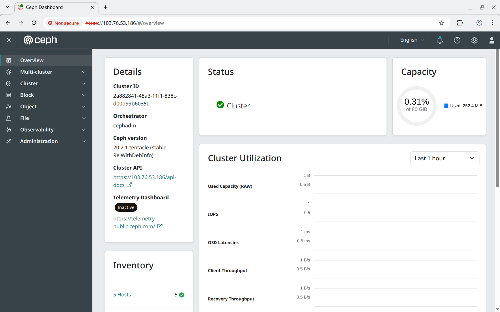

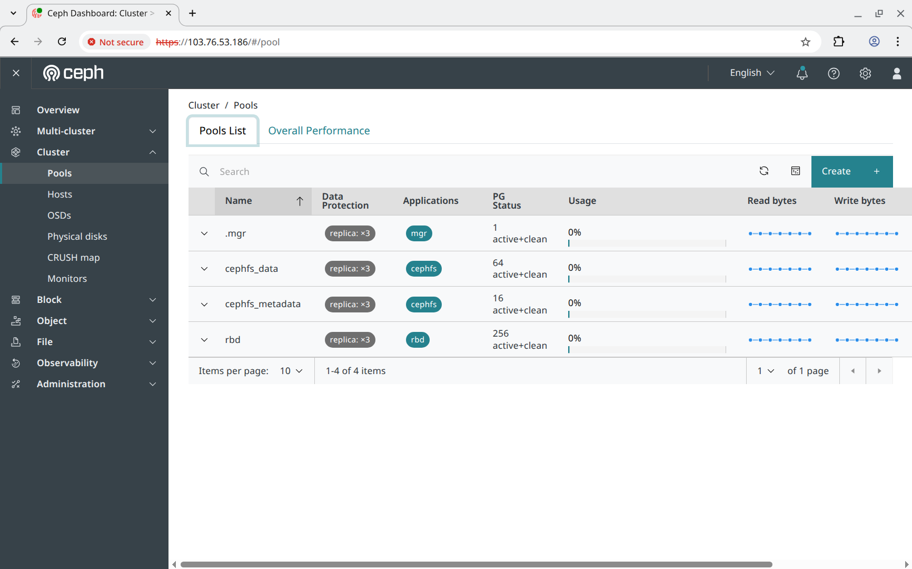

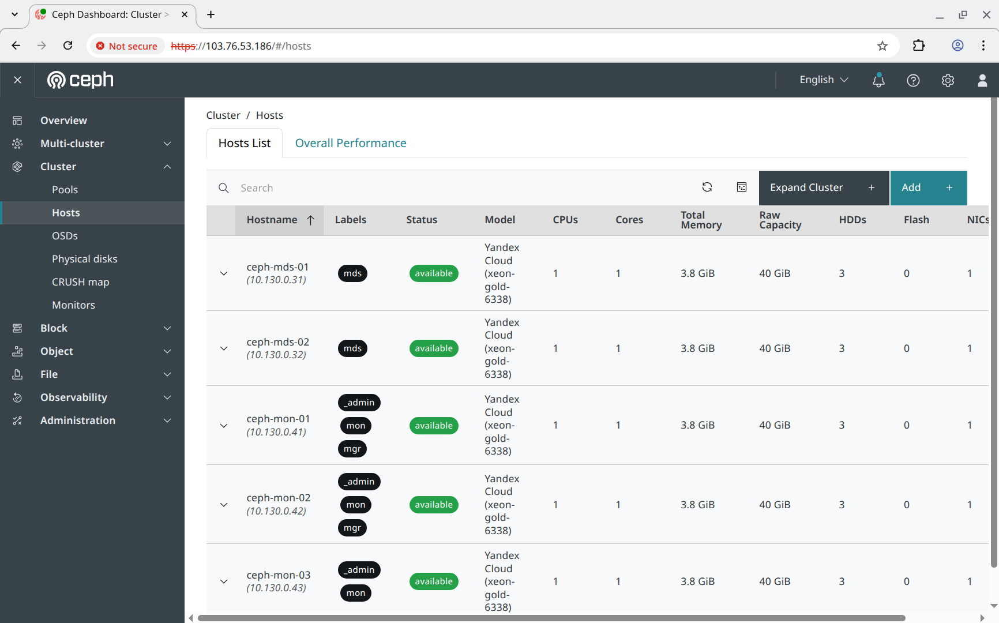

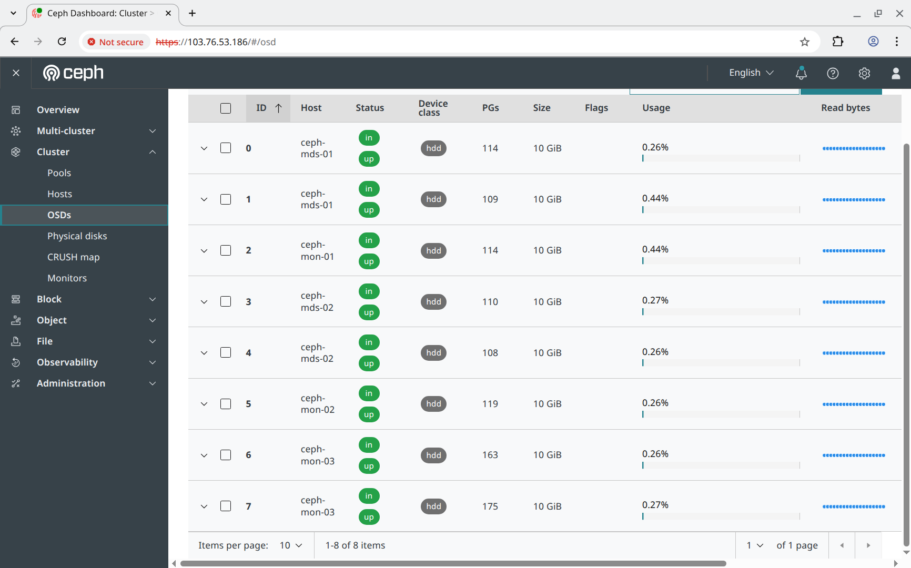

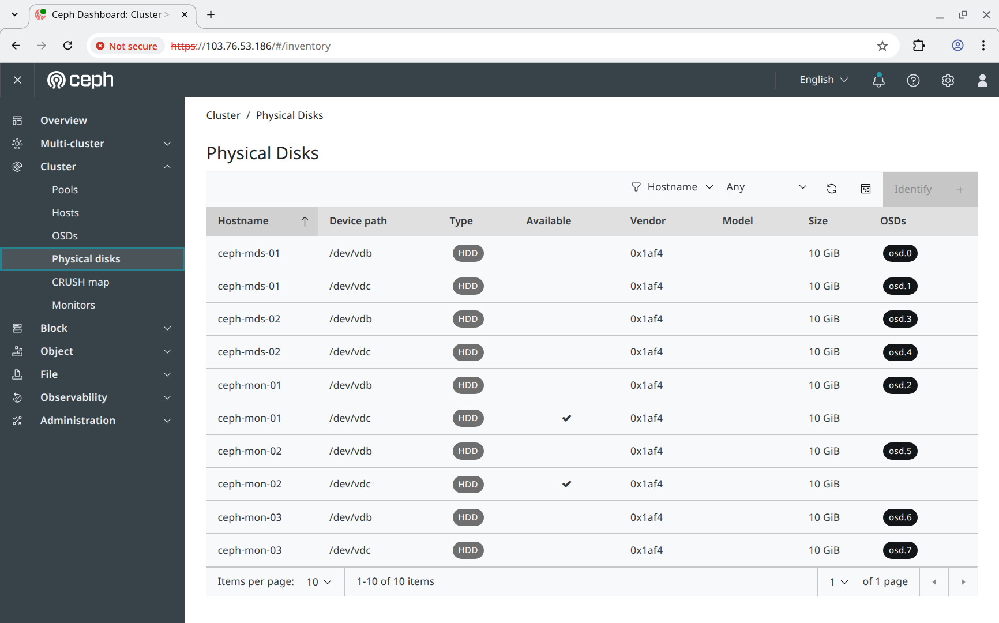

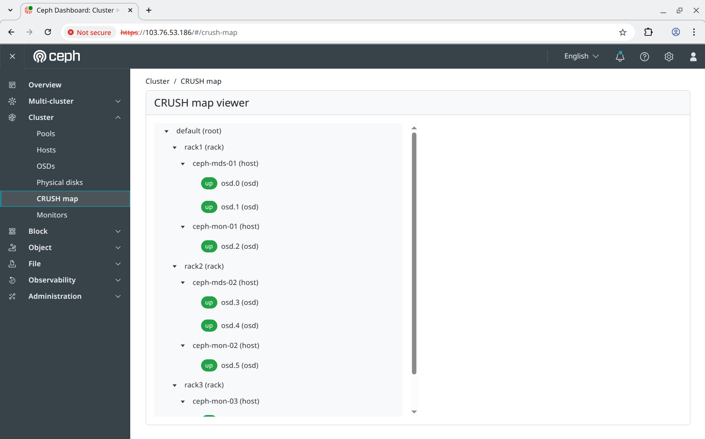

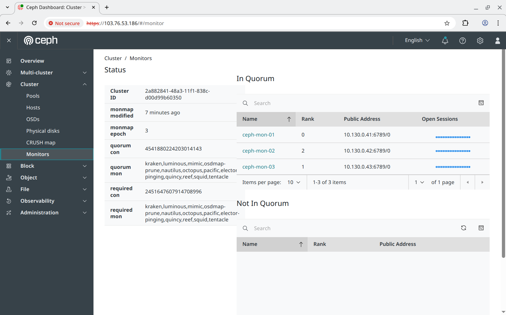

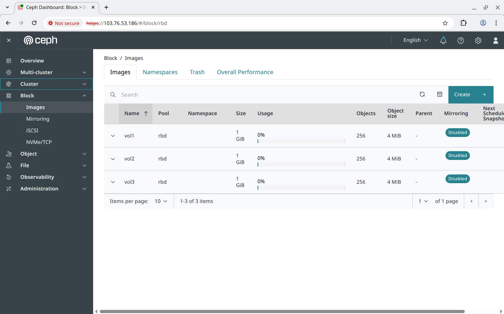

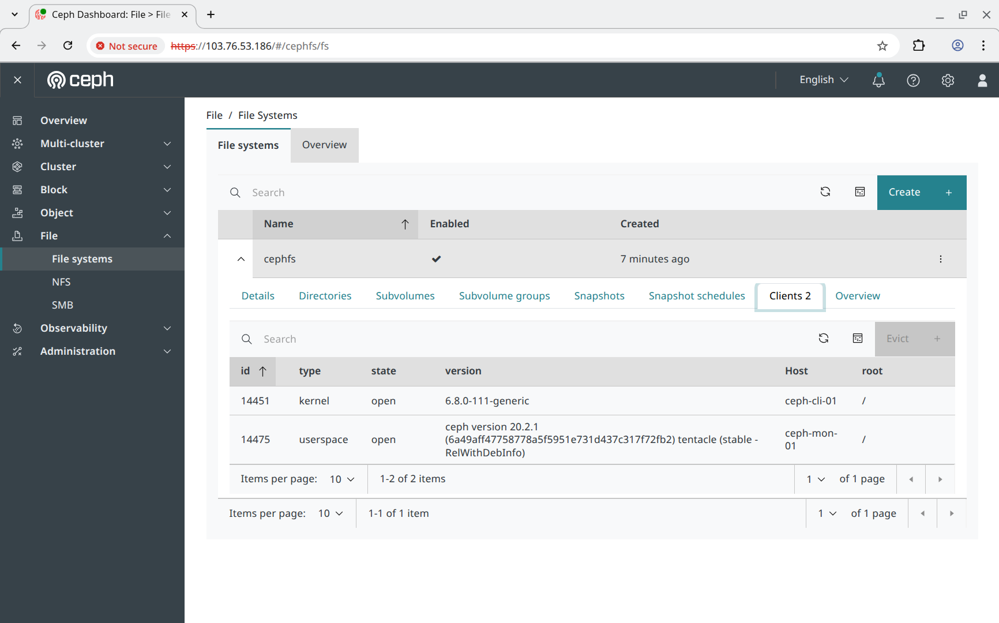

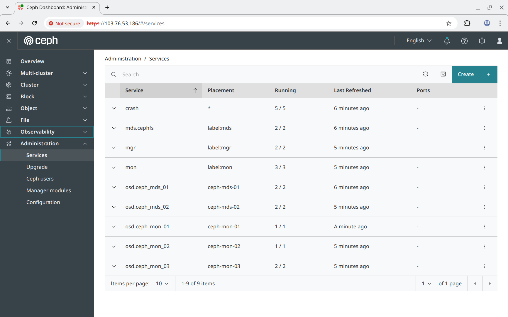

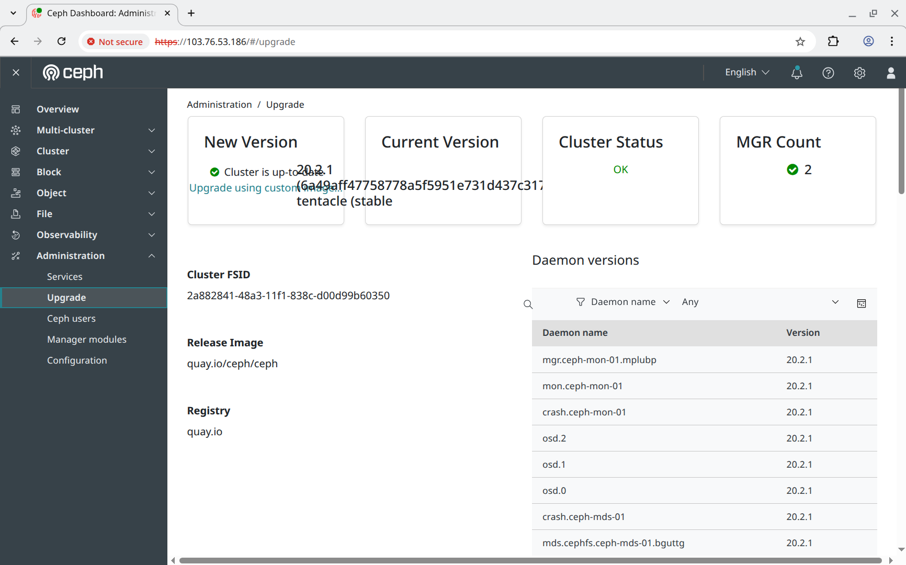

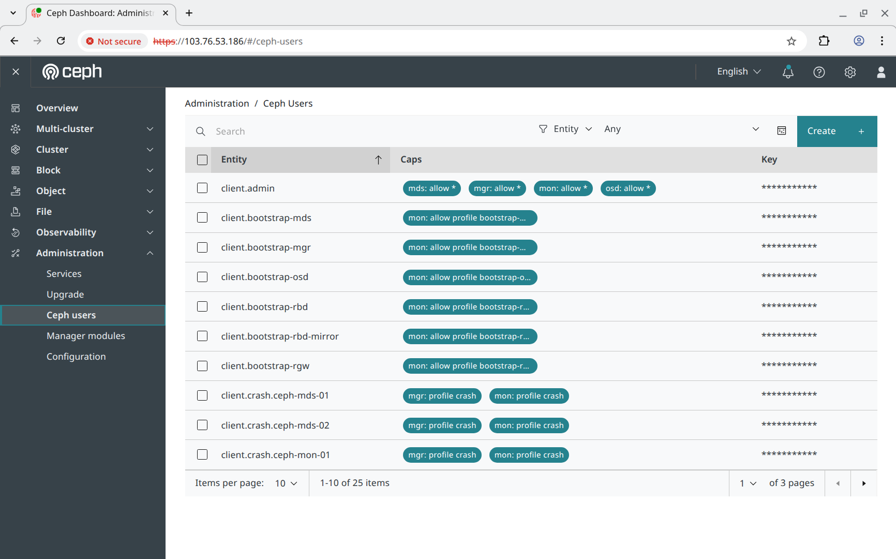

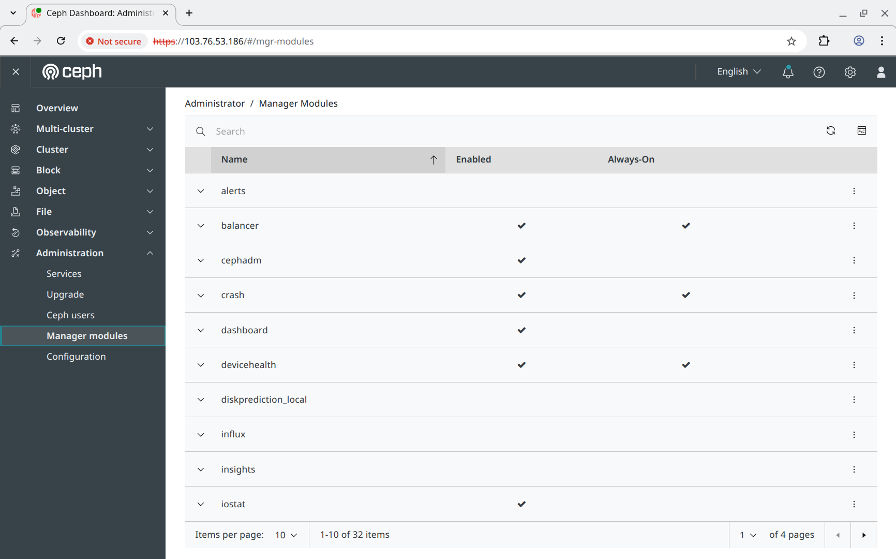
